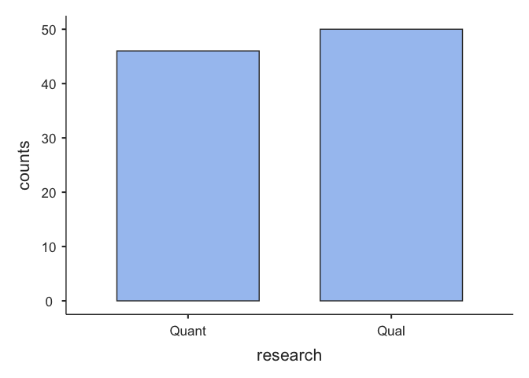
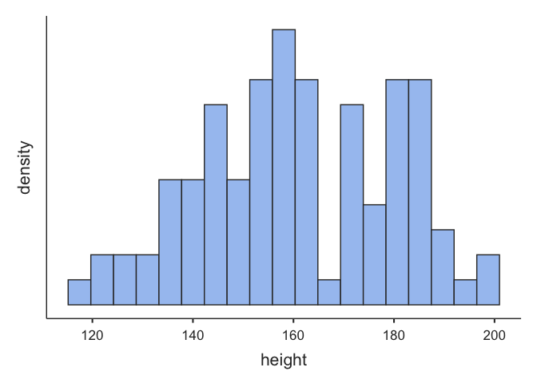
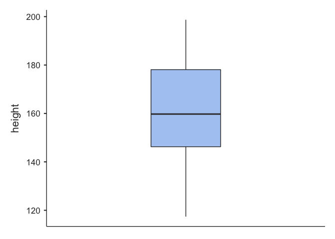
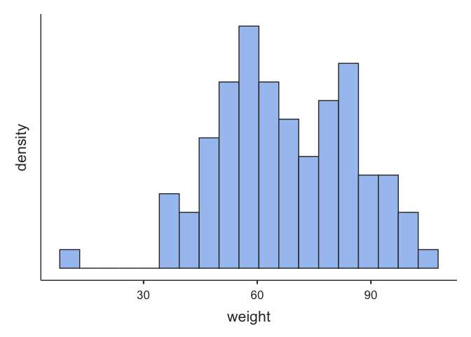
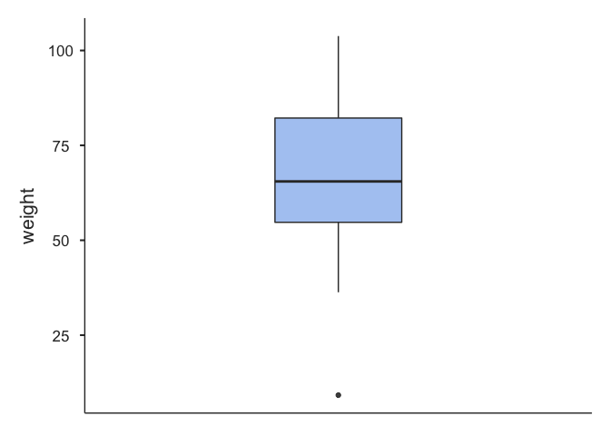

# Data manipulation in Jamovi

## Directions:

Complete each step of the assignment below.

## Package management in R

``` r
# keep a list of the packages used in this script
packages <- c("tidyverse","rio","jmv")
```

This next code block has eval=FALSE because you don’t want to run it
when knitting the file. Installing packages when knitting an R notebook
can be problematic.

``` r
# check each of the packages in the list and install them if they're not installed already
for (i in packages){
  if(! i %in% installed.packages()){
    install.packages(i,dependencies = TRUE)
  }
  # show each package that is checked
  print(i)
}
```

``` r
# load each package into memory so it can be used in the script
for (i in packages){
  library(i,character.only=TRUE)
  # show each package that is loaded
  print(i)
}
```

    ## ── Attaching packages ─────────────────────────────────────── tidyverse 1.3.0 ──

    ## ✓ ggplot2 3.3.3     ✓ purrr   0.3.4
    ## ✓ tibble  3.0.5     ✓ dplyr   1.0.3
    ## ✓ tidyr   1.1.2     ✓ stringr 1.4.0
    ## ✓ readr   1.4.0     ✓ forcats 0.5.1

    ## ── Conflicts ────────────────────────────────────────── tidyverse_conflicts() ──
    ## x dplyr::filter() masks stats::filter()
    ## x dplyr::lag()    masks stats::lag()

    ## [1] "tidyverse"
    ## [1] "rio"
    ## [1] "jmv"

A note about working with packages and functions in R: When installing
packages you may see notifications that SomePackage::function() masks
OtherPackage::function(). What that means is that two different packages
used the same function name. The functions may or may not do the same
thing, but for whatever reason the pogrammers of each package happened
to choose the same name for a function in their respective package. The
last package installed will be the version of that function that will be
used if only the function name is used in your R code. The
SomePackage::function() notation with the colons in it means to use the
function named function() from the package named SomePackage. I think I
have decided when I write R code that I will always try to stick to that
notation. That way it’s very clear which package a desired function
comes from and there will be no problems with masking if different
packages used the same function name.

## Open data file

The rio package works for importing several different types of data
files. We’re going to use it in this class. There are other packages
which can be used to open datasets in R. You can see several options by
clicking on the Import Dataset menu under the Environment tab in
RStudio. (For a csv file like we have this week we’d use either From
Text(base) or From Text (readr). Try it out to see the menu dialog.)

``` r
# import the Week3.rds dataset into RStudio

# Using the file.choose() command allows you to select a file to import from another folder.
# dataset <- rio::import(file.choose())

# This command will allow us to import the rds file included in our project folder.
dataset <- rio::import("Week3.rds")
```

## Get R code from Jamovi output

You can get the R code for most of the analyses you do in Jamovi.

1.  Click on the three vertical dots at the top right of the Jamovi
    window.
2.  Click on the Syndax mode check box at the bottom of the Results
    section.
3.  Close the Settings window by clicking on the Hide Settings arrow at
    the top right of the settings menu.
4.  you should now see the R code for each of the analyses you just ran.

## Run Jamovi code in RStudio

1.  Copy the code for the descriptive statistics for the categorical
    variables in Jamovi and run the code block here in RStudio.

    -   Right click on the code block in Jamovi.
    -   Select Syntax - Copy
    -   Paste it in the code block below.
    -   You may need to change the name of the dataset to match the name
        of the data frame in RStudio. data = week3 (or the name of your
        data frame)

``` r
jmv::descriptives(
    data = dataset,
    vars = vars(sex, research),
    bar = TRUE,
    mean = FALSE,
    median = FALSE)
```

    ## 
    ##  DESCRIPTIVES
    ## 
    ##  Descriptives                   
    ##  ────────────────────────────── 
    ##               sex    research   
    ##  ────────────────────────────── 
    ##    N           96          96   
    ##    Missing      0           0   
    ##    Minimum                      
    ##    Maximum                      
    ##  ──────────────────────────────



1.  Copy the code block for the descriptive statistics for the
    continuous variables and run it here in RStudio.

``` r
jmv::descriptives(
    data = dataset,
    vars = vars(height, weight),
    hist = TRUE,
    box = TRUE,
    sd = TRUE,
    range = TRUE)
```

    ## 
    ##  DESCRIPTIVES
    ## 
    ##  Descriptives                                   
    ##  ────────────────────────────────────────────── 
    ##                          height      weight     
    ##  ────────────────────────────────────────────── 
    ##    N                           96          96   
    ##    Missing                      0           0   
    ##    Mean                  160.7812    67.64375   
    ##    Median                159.7500    65.50000   
    ##    Standard deviation    19.29801    17.85642   
    ##    Range                 81.30000    94.60000   
    ##    Minimum               117.4000    9.200000   
    ##    Maximum               198.7000    103.8000   
    ##  ──────────────────────────────────────────────



## Some notes on Jamovi

-   Some advantages of Jamovi

    -   Jamovi takes some of the difficulty out of remembering commands
        to run statistical analyses by providing point and click menus.
    -   Jamovi is freely available to anyone (and pretty easy to
        install) so it’s easy to share output. (You can also export to
        other formats.)
    -   The jmv package collects basic statistical anayses into a single
        package so it makes learning statistics in R a bit easier.
    -   The Jamovi output is formatted very nicely. The tables are
        pretty much APA compliant.

-   Some limitations of Jamovi

    -   Jamovi does not allow you to make notes or write in the output
        like you can in RStudio. Interpreting output is as important as
        getting output in the first place. Making some notes to go along
        with what you analyze is pretty useful and important.
    -   Jamovi does not currently have the wide variety of packages
        available which can be run in RStudio. It’s a good idea to know
        both.
    -   Jamovi is still undergoing significant development. There are
        some parts which may still be buggy. (Like importing the data
        set and having the empty columns at the beginning.)

## Save your output.

Save this assignment as a markdown file.

## Submit your assignment.

Submit the output you just saved for your assignment.
